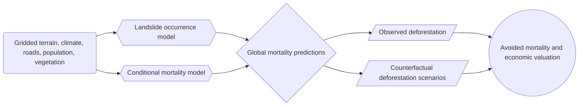

# Forest Protection and Landslide Regulation: A Global Ecosystem Service Methodology to Value Avoided Human Mortality

Code and diagnostics for a project on forest-mediated landslide regulation and avoided human mortality.

> Status: this repository is actively evolving. The workflow, sample definitions, and reported numbers are preliminary and likely to change as the analysis is refined.

## Project Overview

This project studies whether forests and other natural vegetation reduce landslide-related mortality by stabilizing slopes and lowering event probability. The analysis combines gridded environmental data, global landslide observations, and counterfactual deforestation scenarios to estimate avoided deaths and the associated economic value.

At a high level, the workflow is:

## Simplified Method

The manuscript version of the method has three main pieces.

1. Landslide occurrence is modeled at 1 km annual resolution with a binary-response specification using terrain, rainfall, road access, fault proximity, and deforestation exposure.
2. Conditional mortality is modeled separately for landslide events using a hurdle-style severity specification.
3. Observed covariates are compared with counterfactual 5% and 10% deforestation scenarios to estimate avoided mortality and value.

## Repository Contents

- `run_landslide_mitigation.py`: project flow entry point.
- `landslide_mitigation_tasks/`: task definitions, preprocessing, model fitting, and result exports.
- `assets/`: lightweight preview figures and summary tables for the README.

## Preliminary Outputs

These outputs are illustrative and still subject to change.

### Avoided Mortality Maps

### Economic Value Maps

### Summary Tables

#### Regional summary, 5% counterfactual

| Region | Avoided mortality | Value (US$ billions) |
|---|---:|---:|
| Europe & Central Asia | 23,535.1 | 157.20 |
| Latin America & Caribbean | 22,160.1 | 30.06 |
| East Asia & Pacific | 13,430.3 | 40.39 |
| South Asia | 9,890.9 | 3.27 |
| Sub-Saharan Africa | 4,250.2 | 1.05 |
| North America | 474.9 | 3.67 |
| Middle East & North Africa | 257.8 | 0.21 |

#### Regional summary, 10% counterfactual

| Region | Avoided mortality | Value (US$ billions) |
|---|---:|---:|
| Europe & Central Asia | 27,032.7 | 179.39 |
| Latin America & Caribbean | 25,633.1 | 34.59 |
| East Asia & Pacific | 15,013.7 | 44.53 |
| South Asia | 11,167.7 | 3.66 |
| Sub-Saharan Africa | 5,073.4 | 1.27 |
| North America | 519.4 | 4.01 |
| Middle East & North Africa | 328.9 | 0.27 |

## Notes on Data and Releases

- Code is being developed in this repository.
- Data are not yet packaged in a public data repository.
- Public data and result artifacts may be added later once the analysis is finalized.

## Author

[Matthew Braaksma](m-braaksma.github.io), University of Minnesota, Department of Applied Economics

## Citation

If you use this software, please cite it using the metadata in the [CITATION.cff](CITATION.cff) file. 
Alternatively, click the "Cite this repository" button in the sidebar of this GitHub page to export your preferred format.

> Braaksma, M. (2026). Forest Protection and Landslide Regulation: A Global Ecosystem Service Methodology to Value Avoided Human Mortality (Version v0.1.0) [Computer software]. https://github.com/m-braaksma/landslide_mitigation

variable	mean_coefficient	median_coefficient	std_coefficient	min_coefficient	max_coefficient	mean_se	mean_t_stat	mean_p_value	n_tiles_estimated	total_obs
intercept	-12.14887409	-15.4614879	642.0922121	-34862.70043	9872.084775	1759.871149	-1.99786278	0.200462337	6043	398681082
market_access_index	1.743182956	2.427669796	386.3791639	-21826.3109	13200.70524	712.8808984	2.452627534	0.203426755	6043	398681082
temperature	0.24113748	0.003878198	377.0898911	-27474.56191	3002.018991	326.9392975	-0.25938942	0.202447504	6043	398681082
soil_organic_content	-0.736724885	-0.409875348	143.2412753	-9755.962689	628.6554094	14.87290929	-9.045820008	0.191384801	6043	398681082
soil_bulk_density	0.487331903	1.258867264	671.3728648	-2828.183322	51755.32086	216.4789096	2.378626404	0.189701079	6043	398681082
silt_percent	0.625071115	0.393801084	597.560162	-46324.79274	2214.324662	48.59992587	1.375236771	0.231571002	6043	398681082
sand_percent	-0.812402199	-0.551881015	339.988673	-25715.76922	4243.323573	84.70746112	-2.053969041	0.255055471	6043	398681082
clay_percent	-0.339236772	-0.128624084	49.76109616	-3649.132095	429.8624168	31.62178757	-1.483151585	0.241617282	6043	398681082
precip_mm	0.717731884	0.308779804	81.57193627	-6119.780061	697.2501196	43.37847291	2.191088114	0.191208273	6043	398681082
ph	0.893837824	0.502813566	81.09812136	-102.9922171	6029.142087	23.35641647	11.10048563	0.185971642	6043	398681082
elevation	-0.17304906	-0.157951403	38.84422684	-2409.024393	859.7094125	36.21730492	-3.350237846	0.179776158	6043	398681082