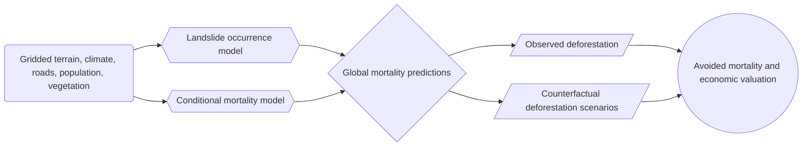
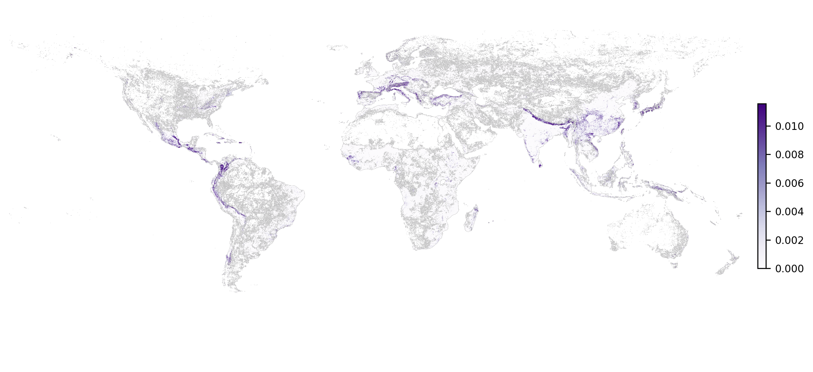
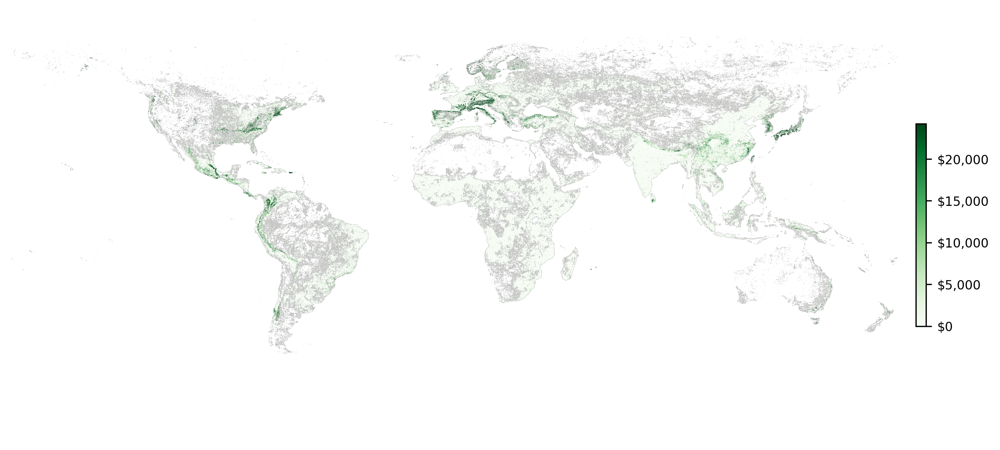
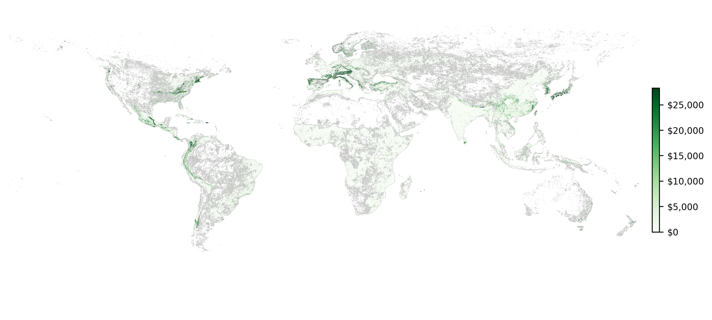

# Forest Protection and Landslide Regulation: A Global Ecosystem Service Methodology to Value Avoided Human Mortality

[](https://github.com/m-braaksma/landslide_mitigation/releases)
[](https://zenodo.org/record/20600890)

Code and diagnostics for a project on forest-mediated landslide regulation and avoided human mortality.

> Status: this repository is actively evolving. The workflow, sample definitions, and reported numbers are preliminary and likely to change as the analysis is refined.

## Project Overview

This project studies whether forests and other natural vegetation reduce landslide-related mortality by stabilizing slopes and lowering event probability. The analysis combines gridded environmental data, global landslide observations, and counterfactual deforestation scenarios to estimate avoided deaths and the associated economic value.

At a high level, the workflow is:



## Simplified Method

The manuscript version of the method has three main pieces.

1. Landslide occurrence is modeled at 1 km annual resolution with a binary-response specification using terrain, rainfall, road access, fault proximity, and deforestation exposure.
2. Conditional mortality is modeled separately for landslide events using a hurdle-style severity specification.
3. Observed covariates are compared with counterfactual 5% and 10% deforestation scenarios to estimate avoided mortality and value.

## Repository Contents

- `run_landslide_mitigation.py`: project flow entry point.
- `landslide_mitigation_tasks/`: task definitions, preprocessing, model fitting, and result exports.
- `assets/`: lightweight preview figures and summary tables for the README.

## Preliminary Outputs

These outputs are illustrative and still subject to change.

### Avoided Mortality Maps




### Economic Value Maps





### Summary Tables

#### Regional summary, 5% counterfactual

| Region | Avoided mortality | Value (US$ billions) |
|---|---:|---:|
| Europe & Central Asia | 23,535.1 | 157.20 |
| Latin America & Caribbean | 22,160.1 | 30.06 |
| East Asia & Pacific | 13,430.3 | 40.39 |
| South Asia | 9,890.9 | 3.27 |
| Sub-Saharan Africa | 4,250.2 | 1.05 |
| North America | 474.9 | 3.67 |
| Middle East & North Africa | 257.8 | 0.21 |

#### Regional summary, 10% counterfactual

| Region | Avoided mortality | Value (US$ billions) |
|---|---:|---:|
| Europe & Central Asia | 27,032.7 | 179.39 |
| Latin America & Caribbean | 25,633.1 | 34.59 |
| East Asia & Pacific | 15,013.7 | 44.53 |
| South Asia | 11,167.7 | 3.66 |
| Sub-Saharan Africa | 5,073.4 | 1.27 |
| North America | 519.4 | 4.01 |
| Middle East & North Africa | 328.9 | 0.27 |


## Notes on Data and Releases

- Code is being developed in this repository.
- Data are not yet packaged in a public data repository.
- Public data and result artifacts may be added later once the analysis is finalized.

## Author

[Matthew Braaksma](m-braaksma.github.io), University of Minnesota, Department of Applied Economics

## Citation

If you use this software, [please cite it](CITATION.cff). 

> Braaksma, M. (2026). Forest Protection and Landslide Regulation: A Global Ecosystem Service Methodology to Value Avoided Human Mortality (Version v0.1.0) [Computer software]. [https://doi.org/10.5281/zenodo.20600889](https://doi.org/10.5281/zenodo.20600889)

```bibtex
@software{Braaksma2026,
  author = {Braaksma, Matthew},
  title = {Forest Protection and Landslide Regulation: A Global Ecosystem Service Methodology to Value Avoided Human Mortality},
  year = {2026},
  version = {v0.1.0},
  doi = {10.5281/zenodo.20600889},
  url = {https://github.com/m-braaksma/landslide\_mitigation}
}
```