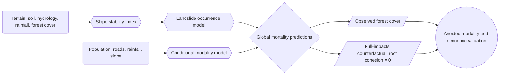
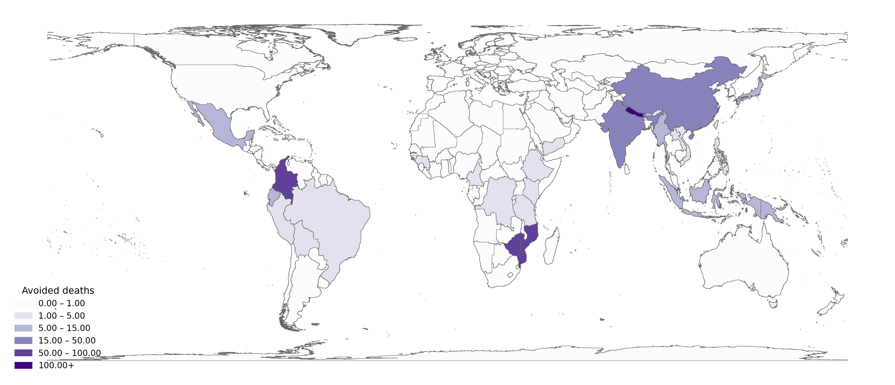
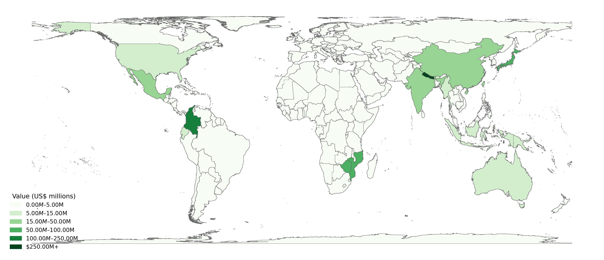

# Forest Protection and Landslide Regulation: A Global Ecosystem Service Methodology to Value Avoided Human Mortality

[](https://github.com/m-braaksma/landslide_mitigation/releases)
[](https://zenodo.org/record/20600889)

Code and diagnostics for a project on forest-mediated landslide regulation and avoided human mortality.

> Status: this repository is actively evolving. The workflow, sample definitions, and reported numbers are preliminary and likely to change as the analysis is refined.

## Project Overview

This project studies whether forests and other natural vegetation reduce landslide-related mortality by stabilizing slopes and lowering event probability. The analysis combines gridded environmental, soil, and hydrological data with global landslide observations to estimate avoided deaths and the associated economic value under a full-impacts counterfactual in which forest-mediated root cohesion is removed.

At a high level, the workflow is:


```mermaid
flowchart LR
    A(Terrain, soil, hydrology, rainfall, forest cover) --> S{{Slope stability index}}
    S --> B{{Landslide occurrence model}}
    A2(Population, roads, rainfall, slope) --> C{{Conditional mortality model}}
    B --> D{Global mortality predictions}
    C --> D
    D --> E[/Observed forest cover/]
    D --> F[/Full-impacts counterfactual: root cohesion = 0/]
    E --> G((Avoided mortality and economic valuation))
    F --> G
```

## Simplified Method

The current version of the method has three main pieces.

1. Landslide occurrence is modeled at 1 km annual resolution as a function of a mechanistic slope-stability index and a rainfall trigger. The stability index is derived from the physics of shallow-landslide initiation (friction, soil and root cohesion, pore-pressure/saturation) rather than fitted from data; only the statistical link between the index and observed occurrence is estimated. Forest cover enters through the index as root cohesion, not as a direct regression covariate.
2. Conditional mortality is modeled separately for realized landslide events using a two-part hurdle specification (probability of any fatality, then expected fatalities given at least one), as a function of population, rainfall, slope, and road density.
3. Observed forest cover is compared against a full-impacts counterfactual in which root cohesion is set to zero everywhere, isolating an upper bound on forest cover's contribution to slope stability, to estimate avoided mortality and its economic value.

## Repository Contents

- `run_landslide_mitigation.py`: project flow entry point.
- `landslide_mitigation_tasks/`: task definitions, preprocessing, model fitting, and result exports.
- `assets/`: lightweight preview figures and summary tables for the README.

## Preliminary Outputs

These outputs are illustrative and still subject to change.

### Avoided Mortality Map



### Economic Value Map



### Summary Table

#### Regional summary, full-impacts counterfactual, 2019

| Region | Avoided mortality | Value (US$ millions) |
|---|---:|---:|
| South Asia | 382.18 | 388.83 |
| Sub-Saharan Africa | 149.41 | 157.50 |
| East Asia & Pacific | 60.82 | 161.19 |
| Latin America & Caribbean | 75.20 | 178.03 |
| North America | 1.05 | 8.25 |
| Europe & Central Asia | 2.21 | 12.26 |
| Middle East & North Africa | 1.90 | 2.03 |
| **Global total** | **672.77** | **908.10** |

## Notes on Data and Releases

- Code is being developed in this repository.
- Data are not yet packaged in a public data repository.
- Public data and result artifacts may be added later once the analysis is finalized.
- The version under review at Ecosystem Services is archived separately at v0.1.0 / DOI 10.5281/zenodo.20600890 and will not change. Everything from v0.2.0 onward reflects an updated methodology developed for this project's integration into GEP.

## Author

[Matthew Braaksma](m-braaksma.github.io), University of Minnesota, Department of Applied Economics

## Citation

If you use this software, [please cite it](CITATION.cff).

```{text}
Braaksma, M. (2026). Forest Protection and Landslide Regulation: A Global Ecosystem Service Methodology to Value Avoided Human Mortality (Version v0.2.0) [Computer software]. https://doi.org/10.5281/zenodo.VERSION_DOI
```

```bibtex
@software{Braaksma2026,
  author = {Braaksma, Matthew},
  title = {Forest Protection and Landslide Regulation: A Global Ecosystem Service Methodology to Value Avoided Human Mortality},
  year = {2026},
  version = {v0.2.0},
  doi = {10.5281/zenodo.VERSION_DOI},
  url = {https://github.com/m-braaksma/landslide\_mitigation}
}
```